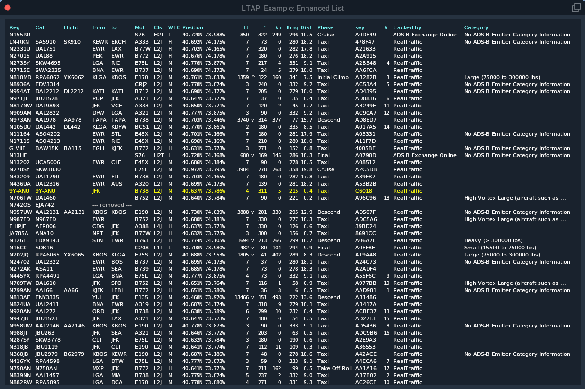

# LTAPI
API to access LiveTraffic's aircraft information

## LTAPI files

You only need to include 2 files into your own projects:
- `LTAPI.cpp`
- `LTAPI.h`

Both files include lots of comments as a basic form of documentation.

## Example Plugin Implementation

The `Example` folder includes an example X-Plane plugin (based on the [Hello World plugin](https://developer.x-plane.com/code-sample/hello-world-sdk-3/)), which demonstrates the most simplistic usage as well as an enhanced way of using the API by subclassing the provided LTAPIAircraft class.

The plugin just opens two windows and shows information about LiveTraffic's aircrafts as text.

### Simple Example

...starts at around line 195. Look for `MARK: LTAPI Simple Example`. It just
- uses a static `LTAPIConnect` object,
- calls its function `UpdateAcList()` every second via a flight loop callback, and
- loops the resulting map of aircrafts for display of textual information in the output window.

### Enhanced Example

...starts at around line 268. Look for `MARK: LTAPI Enhanced Example`. This demonstrates how to use `LTAPIAircraft` as a base class for some own class. Often, you have your own way of representing aircrafts in your app already. You can add `LTAPIAircraft` as a base class and then don't need to copy information back and forth but have access to it right from within your own class.

For this to work you
- need to subclass `LTAPIAircraft`,
- may want to do init/cleanup work in the constructor and destructor,
- may want to override `virtual bool updateAircraft()` so that you can do some own work whenever a/c information changes,
- must provide a callback for creating new empty objects when `LTAPIConnect::UpdateAcList()` finds a new aircraft in the sky.

All the rest of the code deals with the example, which is: The class `EnhAircraft` also manages the line number in the output display, i.e. once it found a line it stays there. Also allows to show text "---removed---" for some time when a/c was removed.

## Building the Example

- Mac: Open the XCode project `LTAPI.xcodeproj`. There might be paths you way want to check...especially the path the resulting plugin is copied to after build (Targets > Build Phases > Copy Files).
- Windows: Open the Visual Studio solution `LTAPI.sln`. Also here you might need to check directories. There is a copy command to my X-Plane installation in the _Post Build Event_.
- Linux: As I don't have a Linux environment myself I provide a Docker environment to build the Linux version, which I have not tested yet. Can't even say if it starts.
    - You need [Docker](https://www.docker.com/get-started)
    - `cd docker`
    - `make`

## What is looks like

